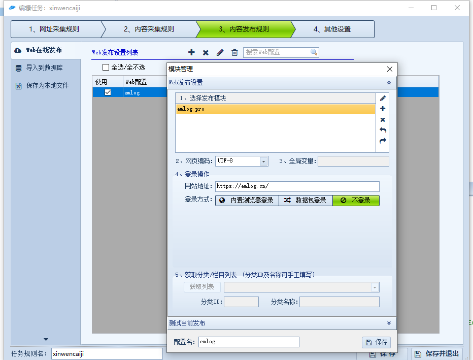
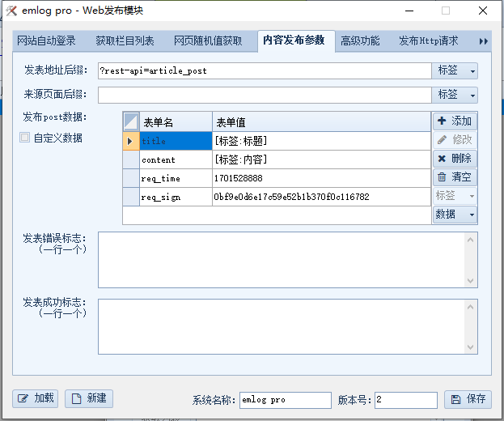
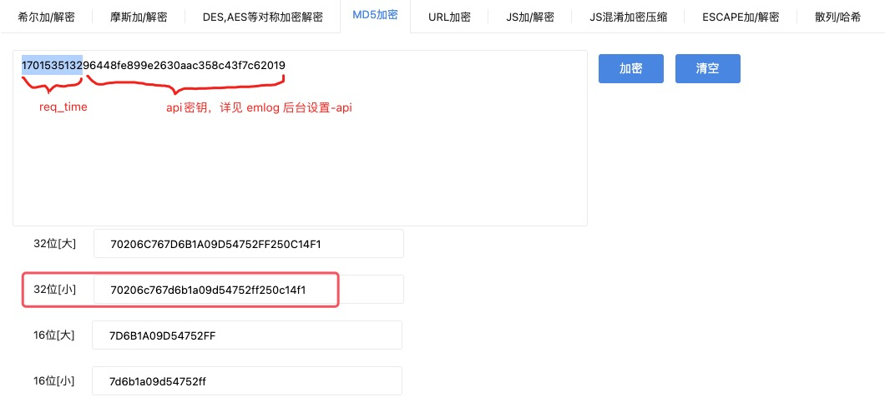

# &#x1F352; API application: docking collector

The docking collector publishes the collected articles to the site built by emlog.
This document takes [Train Collector](http://www.locoy.com/) as an example.

## Preparation

- Enable API in emlog background: System settings -&gt; API, and copy the API key for backup

## Content publishing rules

Web publishing configuration is as shown above:

- Add a publishing module, see below
- Set the Web page encoding to UTF-8
- Website URL: fill in the URL of the website built by your emlog, such as: https://emlog.cn/
- Login method: Choose to not log in

## Add publishing module

Add publish module configuration, see the picture above

Posting address suffix: `?rest-api=article_post`

Publish post data:
- title: article title
- content: article content
- req_time: timestamp, such as: 1701535132, you can get the timestamp from here: [Get timestamp](https://tool.lu/timestamp/)
- req_sign: Put req_time and API key together for MD5 encryption, which can be found here: [MD5 Encryption](https://tool.chinaz.com/tools/md5.aspx), as shown below

For other post parameters, please see: [Article Publishing API Documentation](/docs/api/#post_article)

## Related information

- Detailed usage of docking collector: [Video tutorial](http://www.locoy.com/index/video_detail/cat_id/12)

## Connecting with other collectors

- Connecting to `Simple Number Collector`: [See the document for details](http://www.keydatas.com/preview_article/fYnENjiUjMZz)
- Docking [Blue Sky Collector](https://www.skycaiji.com/): [See the plug-in for details](https://www.emlog.net/plugin/detail/385)
