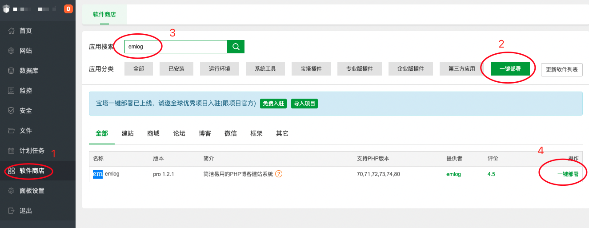
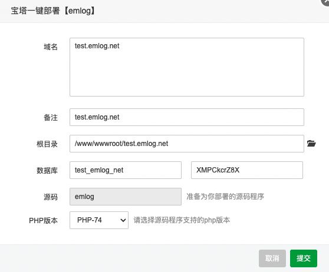
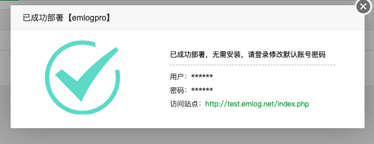

# &#x1f964; One-click Emlog deployment and installation in Pagoda panel

## Introduction

Pagoda Panel is a server management software that supports more than 100 server management functions such as one-click LAMP/LNMP/cluster/monitoring/website/FTP/database/JAVA. For details, please see: [Pagoda Panel](https://www.bt.cn)

## Install Pagoda Panel

- Users who have already installed Pagoda Panel, please skip this step.

* For Linux version installation, please see: https://www.bt.cn/download/linux.html
* For Windows version installation, see: https://www.bt.cn/download/windows.html

- Web service installation: nginx
- PHP5.6 or higher, PHP7.4 recommended
- MySQL5.6 or higher, MySQL5.6 is recommended

## Start deploying Emlog

### 1. Search "emlog" in software store

#### Software Store -> Search Application "emlog", Application category one-click deployment

### 2. Fill in the deployment information

- The first input in the window is the domain name that has been resolved and bound to the server. For example, our test domain name here is test.emlog.net.
- The database name and password can be modified or randomly generated by the system
- For php version, choose 5.6 or higher.

### 3. Deployment successful

- When you see that the interface in the picture below has been deployed, click to visit the site to set the administrator information.

### 4. Set administrator account password

- Follow the prompts to fill in the account and password of the site backend administrator.
- Click Next to complete the installation.
